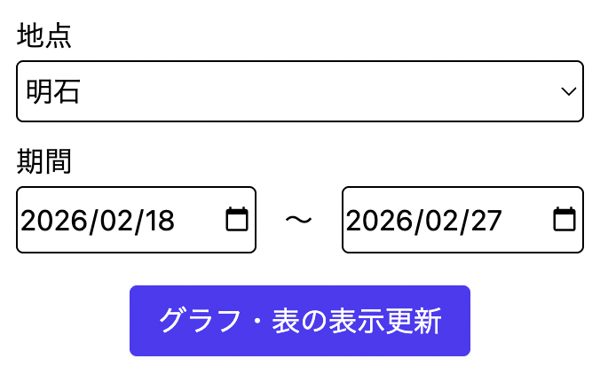
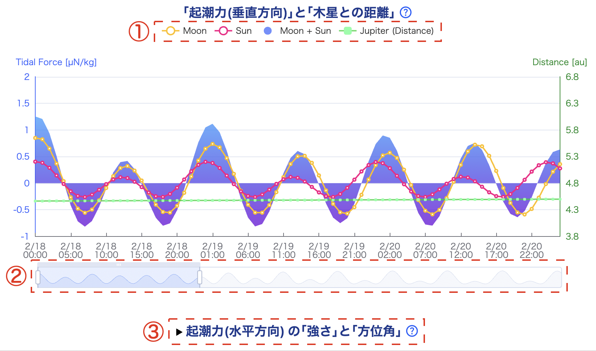
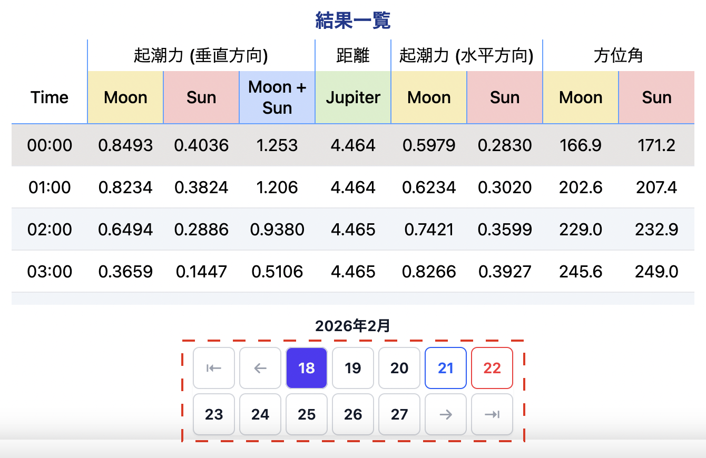
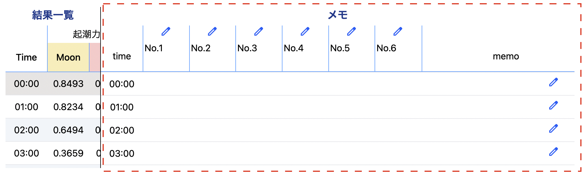

# Tidal Force Plus

[**Tidal Force Plus**](https://tidal-force-plus.net/) は、「月・太陽による起潮力（潮汐力）」や「木星」の影響を調べたい人向けの、データ提供サービスです

- 「月・太陽による起潮力（潮汐力）」と「木星との距離」を計算します
- ログインすると、メモ機能が使えます

## 使い方

- 地点と期間を入力し、表示更新ボタンをクリックすると、各計算結果の表が更新されます<br>
  
- グラフについて<br>
  ①凡例をクリックすると、表示・非表示を切り替えられます<br>
  ②スライダーで、表示期間を調整できます<br>
  ③グラフ（水平方向）は、グラフのタイトルをクリックすると表示されます<br>
  
- 表について<br>
  見たい日付は、下部の数字で選択できます<br>
  
- メモについて<br>
  ログインすると、計算結果の横に、メモ欄が表示されます<br>
  「メモのタイトル」の編集や、「メモ」に記録を残すには、
  
  をクリックして下さい<br>
  

## 開発環境の構築

### アプリケーションのセットアップ

1. リポジトリをクローンする
   ```
   git clone https://github.com/nishitatsu-dev/tidal-force-plus.git
   ```
2. 生成された`tidal-force-plus`ディレクトリで、以下のコマンドを実行する<br>
   `bin/setup`
3. ローカルサーバーの起動は、以下のコマンドを実行する<br>
   `bin/dev`

### Google OAuth 2.0の設定

1. OAuth 2.0 クライアント IDを作成する<br>
   - 参考：[アクセス認証情報を作成する  \|  Google Workspace  \|  Google for Developers](https://developers.google.com/workspace/guides/create-credentials?hl=ja#oauth-client-id)
   - 承認済みの JavaScript 生成元<br>
     `http://localhost`<br>
     `http://localhost:3000`
   - 承認済みのリダイレクト URI<br>
     `http://localhost:3000/users/auth/google_oauth2/callback`
1. 「ID」と「シークレット」をメモし、`.env.development.local`ファイルで以下を設定する
   ```
   GOOGLE_CLIENT_ID=メモした値
   GOOGLE_CLIENT_SECRET=メモした値
   ```

### Lint

- Rubocop<br>
  `./bin/rubocop`
- ERB Lint<br>
  `bundle exec erb_lint --lint-all`
- ESLint<br>
  `npx eslint app/javascript`
- Prettier<br>
  `npx prettier app/javascript --check`：チェック<br>
  `npx prettier app/javascript --write`：自動修正

### Test

- Minitest<br>
  `bin/rails test`：システムテスト以外<br>
  `bin/rails test:system`：システムテストのみ<br>
  `bin/rails test:all`：全てのテスト

## 使用技術

### バックエンド

- Ruby on Rails 8.0
- Ruby 3.4

### フロントエンド

- JavaScript
- Hotwire
- Tailwind CSS

### データベース

- SQLite

### インフラ

- さくらのVPS
- Kamal

### 認証

- devise
- omniauth
- omniauth-google-oauth2
- omniauth-rails_csrf_protection

### 外部サービス

- Apache ECharts
- Google OAuth 2.0

### CI/CD

- GitHub Actions

### テスト

- Minitest

### Linter/Formatter

- Rubocop
- ERB Lint
- ESLint
- Prettier
